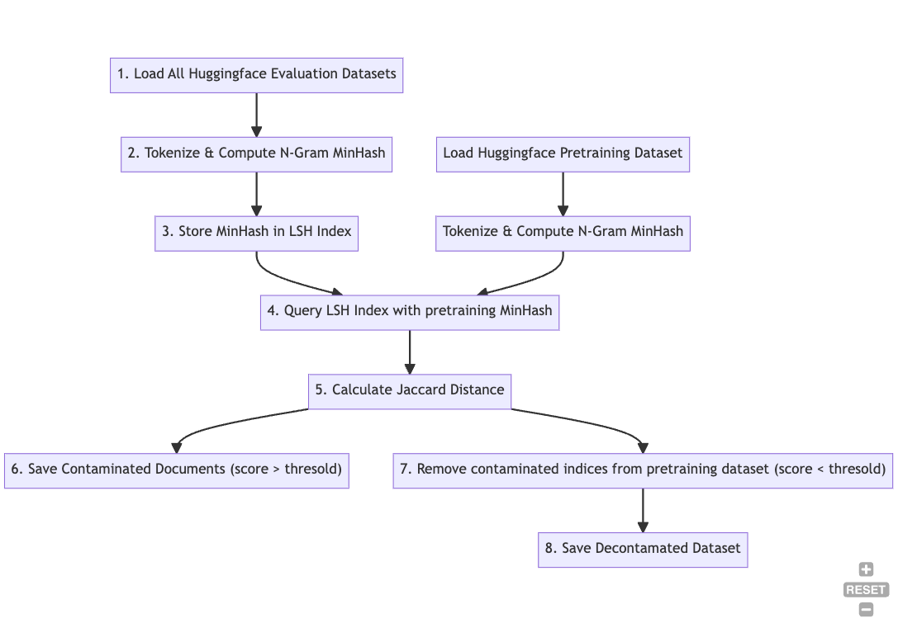

# OpenThaiGPT Decontamination Pipeline

## Description

The OpenThaiGPT Decontamination Pieline is designed to combat leaking of training dataset into evaluation process. The goal of this pipeline is to identify and remove potentially duplicated documents used in evlaution process from pretraining dataset.
This contamination check is based on N-Gram MinHash and LSH (Locality-Sensitive Hashing) techniques inspired by the methods presented in this .



## Workflow

1. Evaluation Dataset Processing:

- Load all evaluation datasets.
- Tokenize the content of the text column using the newmm tokenizer from the nlpo3 library.
- Compute N-Gram MinHash for each tokenized text.
- Save each dataset (content and minhash) separately in a pickle format.

2. Pretraining Dataset Processing:

- Load the Huggingface pretraining dataset from the specified path.
- Compute the MinHash for the pretraining dataset.
- Store the computed MinHash results on disk in a Huggingface dataset format.

3. LSH Indexing:

- For each evaluation dataset, load its MinHash values into an LSH index.

4. Query & Neighbor Identification:

- Compare the entire pretraining dataset against the LSH index of each evaluation dataset.
- Save indices of documents with a similarity score exceeding the defined threshold, marking them as potential contamination.

5. Contamination Check:

- For each document in the pretraining dataset, compute the approximate Jaccard distance with its potential contaminated documents.
- Compute approximate jaccard of score surpasses the threshold, mark the document as contaminated.

6. Document Removal:

- Remove all identified contaminated documents from the pretraining dataset.

7. Saving the Dataset:

- Store the decontaminated documents in a new Huggingface dataset on disk.
- Store the index and data of contaminated document pair into `contaminated_results_{num_perm}.csv` file.

## Usage

**Prerequisites:** Install openthai-gpt-data depedencies because running this code [link](/src/data/README.md)

Conda

```
python ./src/data/scripts/decontamination/decontaminate.py
```

Apptainer

```
apptainer run -B /lustrefs/flash/scratch --home /project/lt200056-opgpth/openthaigpt-refactor image_sandbox python ./src/data/scripts/decontamination/decontaminate.py
```

Note:

- We run it on ThaiSC Lanta's scratch disk to improve the I/O performance
- We tested it with Apptainer, but conda python should also work
- We run it on Memory node of Lanta but Compute node should also work without OOM
- Command `export HF_DATASETS_CACHE="/project/lt200056-opgpth/openthaigpt-refactor/.cache"` is needed to prevent Huggingface storing cache in home directory and empty disk storage quota.

## I/O

`Huggingface input dataset format`

```json
{
    "train": ["text", ...], // column names
    "validate": ["text", ...] // column names
    ...
}
```

`config/deduplicaiton.yaml`

```yaml

defaults:
  - datasets:
    - Name of the files inside `condig/datasets` directory
    ...

train_dataset:
  key: openthaigpt
  name: openthaigpt_pretraining_dataset
  available_on_hub: False
  path_name: Path of the pretraining datset
  split: Choose Split to use from Huggingface Dataset ex. 'train'
  col_name: Column name to process # text

minhash:
  newmm_dict: Path to store NewMM Dict
  save_path: Path to store minhash

decontaminate:
  thresold: jaccard similarity and LSH thresold 0.3
  minhash_path: Path to store minhash
  save_path: Path to save deduplicated dataset (For further training usage)

global_config:
  num_process: Process need to use (128 on Lanta)
  num_perm: Permutation number to use with MinHash (default 128)

train_dataset:
  split: Choose Split to use from Huggingface Dataset ex. 'train'

minhash:
  save_path: Path to store minhash

deduplication:
  thresold: jaccard similarity and LSH thresold 0.9
  minhash_path: Path to store minhash
  save_path: Path to save deduplicated dataset (For further training usage)
  save_path_duplicated: path to save duplicated dataset (for EDA)
  batch_size: batch size for huggingface map function

global_config:
  num_process: Process need to use (128 on Lanta)
  num_perm: Permutation number to use with MinHash (default 128)
```

`config/datasets/dataset_name.yaml`

Load from Huggingface hub case

```yaml
xquad:
  name: xquad # For reference
  available_on_hub: True
  path_name: xquad # Must be available name on Huggingface hub
  split: validation
  subset: xquad.th # Some dataset has subset, if not can leave blank
```

Load from disk case.

```yaml
lst20:
  name: LST20 # For reference
  available_on_hub: True
  path_name: lst20
  path: /scratch/lt200056-opgpth/LST20_Corpus
  split: validation
  subset:
```

## Default Parameters

- `N_GRAM` = 5
