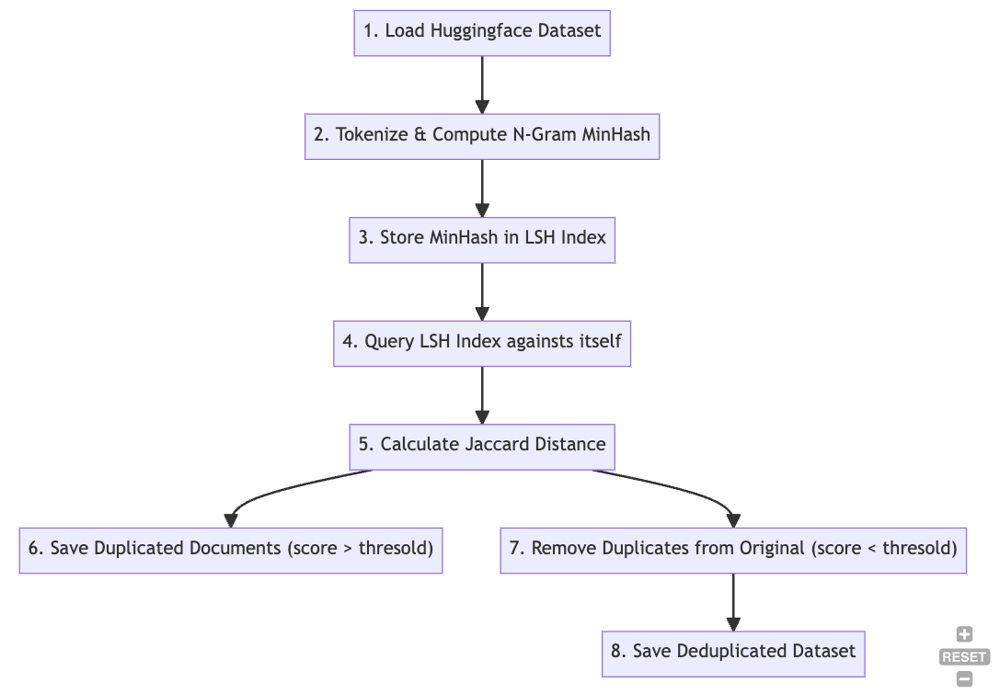

# OpenThaiGPT Deuplication Pipeline

## Description

The OpenThaiGPT Deduplication Pipeline is designed to remove duplicated entries from the Huggingface datasets. By using the techniques similar to this [paper](https://arxiv.org/abs/2107.06499), the pipeline uses the N-Gram MinHash approach in combination with LSH (Locality-Sensitive Hashing) to identify and eliminate duplicate content.



## Workflow

1. Dataset Preparation:

- Load the Huggingface dataset from the specified path.
- Tokenize the content in the text column using the newmm tokenizer from the nlpo3 library.
- Compute N-Gram MinHash for the tokenized text.
  Store the MinHash results in a Huggingface dataset format on disk.

2. LSH Indexing:

- Load the computed MinHash dataset alongside the original dataset.
- Index the MinHash of all documents using LSH.

3. Neighbor Identification:

- Query each pretraining document on against the LSH index.
- Marking neighbors that have a similarity score exceeding the defined threshold as potentially duplicated.

4. Duplicate Detection:

- For each potentially duplicated document, compute the approximate Jaccard distance with its identified neighbors.
- Mark documents with Jaccard scores surpassing the threshold as duplicates.

5. Duplicate Removal:

- Extract all identified duplicate documents from the original dataset.

6. Saving the Deduplicated Dataset:

- Store the deduplicated documents in a new Huggingface dataset on disk.
- Save all identified duplicate documents in a separate Huggingface dataset format. This provides a record of duplicates for reference or potential restoration.

## Usage

**Prerequisites:** Install openthai-gpt-data depedencies because running this code [link](/src/data/README.md)

Conda

```
python ./src/data/scripts/deduplication/deduplicate.py
```

Apptainer

```
apptainer run -B /lustrefs/flash/scratch --home /project/lt200056-opgpth/openthaigpt-refactor image_sandbox python ./src/data/scripts/deduplication/deduplicate.py
```

Note:

- We run it on ThaiSC Lanta's scratch disk to improve the I/O performance
- We tested it with Apptainer, but conda python should also work
- We run it on Memory node of Lanta but Compute node should also work without OOM
- Command `export HF_DATASETS_CACHE="/project/lt200056-opgpth/openthaigpt-refactor/.cache"` is needed to prevent Huggingface storing cache in home directory and empty disk storage quota.

## I/O

`Huggingface input dataset format`

```json
{
    "train": ["text", ...], // column names
    "validate": ["text", ...] // column names
    ...
}
```

`config/deduplicaiton.yaml`

```yaml
train_dataset:
  split: Choose Split to use from Huggingface Dataset ex. 'train'

minhash:
  save_path: Path to store minhash

deduplication:
  thresold: jaccard similarity and LSH thresold 0.9
  minhash_path: Path to store minhash
  save_path: Path to save deduplicated dataset (For further training usage)
  save_path_duplicated: path to save duplicated dataset (for EDA)
  batch_size: batch size for huggingface map function

global_config:
  num_process: Process need to use (128 on Lanta)
  num_perm: Permutation number to use with MinHash (default 128)
```

## Default Parameters

- `N_GRAM` = 5
