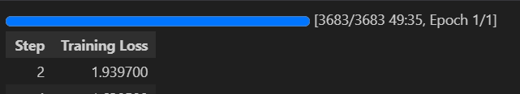

# QLoRA vs LoRA Experiment interm of Training time and tflops used

Train via runing the ipynb file with an A100 GPU  
Control: Same dataset, batch_size, optimizer, and other settings  
Independent variable: quantization_config argument in the model loading method: AutoModelForCausalLM.from_pretrained()   

LoRA Tensorboard: https://colab.research.google.com/drive/1UFi3WgozGlP1OrswuIlCSbnBZRNdRXuy?usp=sharing  
QLoRA Tensorboard: https://colab.research.google.com/drive/1kgXey6DsPeitXMa_ziGOKqdSCwZork9k?usp=sharing
  

## LoRA training time

  
## QLoRA training time

 
the reference for code: https://github.com/aws-samples/amazon-sagemaker-generativeai/blob/main/studio-notebook-fine-tuning/falcon-40b-qlora-finetune-summarize.ipynb
  
Observation: quantized peft model take longer time to be trained with the same setup than normal peft model.