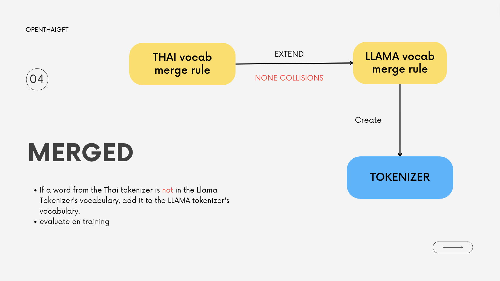

# OpenThaiGPT Merged Tokenizer Pipeline

We plan to use [Pretrained LLaMA Model](https://ai.meta.com/blog/large-language-model-llama-meta-ai/) as a base model for finetuning but LLaMa Tokenizer (BPE Tokenizer) have less Thai vocabulary, this pipeline intend to extent vocabulary of LlaMA tokenizer, using merge method following [Chinese-LLaMA-Alpaca](https://github.com/ymcui/Chinese-LLaMA-Alpaca/blob/main/README_EN.md)

## Method

- merge LLaMA tokenizer by extenting vocabulary and merge rule from BPE Thai tokenizer
  

## merge and save merge tokenizer

1. load LLaMA tokenizer by pass your model name to an argument

```bash
python src/model/scripts/llama_thai_tokenizer/load_tokenizer.py --model_name meta-llama/Llama-2-7b --output_path <output_tokenizer_path>
```

argument

- model_name: name of LLaMA model that you use
- output_path: path to save

2. merge tokenizer `need to have Thai BPE tokenizer first` then add path of it be an argument of following script

```bash
python scripts/llama_thai_tokenizer/merge_tokenizer.py --llama_path <llama_model_path> --thai_sp_path <spm_model_path> --output_path <output_tokenizer_path>
```

argument

- llama_path: path to LLaMA tokenizer
- thai_sp_path: path to Thai BPE tokenizer
- output_path: path to save

## To test merged tokenizer

1.  run llama_thai_token_test.py and inference time checked
    `python3 scripts/llama_thai_tokenizer/time_inference_check.py`

### Results after merging

- Text : การใช้งานหลักของ LLaMA คือการวิจัยเกี่ยวกับรูปแบบภาษาที่ใหญ่
- Tokenized by LLaMA tokenizer: ['▁', 'ก', 'า', 'ร', '<0xE0>', '<0xB9>', '<0x83>', 'ช', '้', 'ง', 'า', 'น', 'ห', 'ล', 'ั', 'ก', 'ข', 'อ', 'ง', '▁L', 'La', 'MA', '▁', 'ค', 'ื', 'อ', 'ก', 'า', 'ร', 'ว', 'ิ', 'จ', 'ั', 'ย', 'เ', 'ก', 'ี', '่', 'ย', 'ว', 'ก', 'ั', 'บ', 'ร', 'ู', 'ป', 'แ', 'บ', 'บ', 'ภ', 'า', 'ษ', 'า', 'ท', 'ี', '่', '<0xE0>', '<0xB9>', '<0x83>', 'ห', 'ญ', '่']
- Tokenized by English-Thai LLaMA tokenizer: ['▁การใช้งาน', 'หลักของ', '▁L', 'La', 'MA', '▁คือการ', 'วิจัย', 'เกี่ยวกับ', 'รูปแบบ', 'ภาษา', 'ที่ใหญ่']
- EngOnly time: 0.00027060508728027344
- EngThai time: 0.00016260147094726562
- time diff: 0.00010800361633300781
